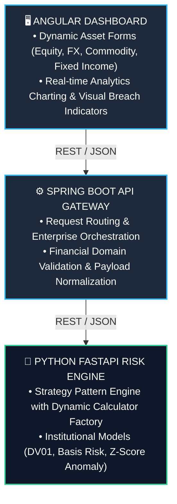
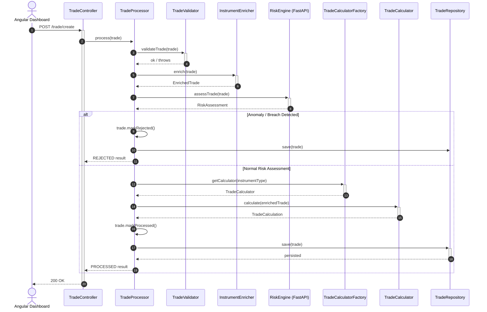
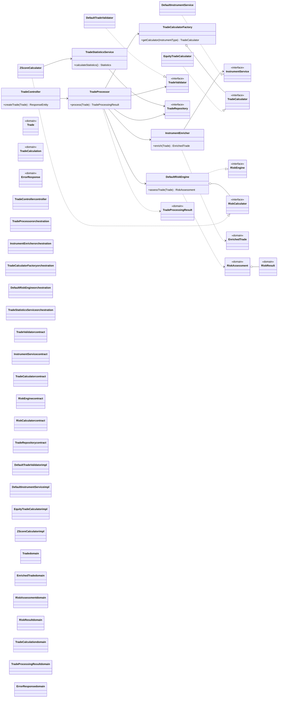

# 🚀 Enterprise Multi-Asset Risk Intelligence Platform

A high-performance, real-time quantitative risk assessment platform designed for modern trading environments. Built using a modular full-stack architecture (**Angular UI**, **Spring Boot API Gateway**, and **Python FastAPI Risk Engine**), it dynamically validates, enriches, computes, and visualizes asset-specific risk metrics across global asset classes.

---

## 📸 Dashboard Preview


---

## 🏗️ System Architecture

The platform follows a decoupled, three-tier architecture ensuring high throughput, clear separation of concerns, and seamless scalability for adding new quantitative risk models.



### Request Flow



### Class Structure



---

## 💻 Local Development Setup

### 1. Clone Repository

```bash
git clone https://github.com/ramkiran25/trade-processor.git
cd trade-processor
```

### 2. Python Risk Engine

```bash
cd python-service
python -m venv venv
# On Windows: venv\Scripts\activate | On macOS/Linux: source venv/bin/activate
pip install -r requirements.txt
uvicorn app.main:app --reload --port 8000
```

### 3. Spring Boot Gateway

```bash
cd ../backend-service
./mvnw spring-boot:run
```

### 4. Angular Dashboard

```bash
cd ../angular-frontend
npm install
ng serve --open
```

---

## 🔗 API & Local Endpoints

Once the application services are running locally:

- **Swagger UI:** http://localhost:8080/swagger-ui.html
- **OpenAPI Spec:** http://localhost:8080/v3/api-docs
- **H2 Console:** http://localhost:8080/h2-console (JDBC URL configured in `application.properties`)
