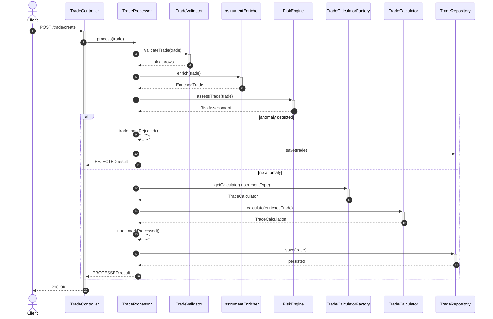

# Trade Processor

A Spring Boot service that validates, enriches, risk-assesses, and persists financial
trades — built as a hands-on exercise in layered architecture, the Strategy/Factory
patterns, and production-grade Spring practices (JPA persistence, centralized exception
handling, OpenAPI docs, automated testing).

## Features

- **Trade intake and validation** via `POST /trade/create`
- **Instrument enrichment** — augments incoming trades with reference data (instrument type)
- **Z-score based risk assessment** — flags anomalous trades against the historical
  notional distribution before they're processed
- **Pluggable notional calculation** per instrument type (Strategy pattern; currently
  `EQUITY`, extensible to FX/bond/derivative)
- **Centralized error handling** — malformed requests, validation failures, and
  unsupported instruments all return structured, typed error responses
- **Dummy data seeding** on startup for local testing of the risk engine
- **Swagger / OpenAPI UI** for interactive API testing
- **H2 in-memory database** for zero-setup local development

## Tech stack

| Layer | Technology |
|---|---|
| Language | Java 17 |
| Framework | Spring Boot 4 (Spring MVC, Spring Data JPA) |
| Database | H2 (in-memory) |
| API docs | springdoc-openapi (Swagger UI) |
| Testing | JUnit 5, Mockito |
| Build | Maven |

## Architecture

The service follows a layered architecture: controllers stay thin, a processor
orchestrates the workflow, and instrument-specific or risk-specific logic is isolated
behind Strategy interfaces so new instrument types or risk checks can be added without
touching existing code.


**Legend:** blue = controller · green = orchestration · amber = contracts (interfaces) · orange = implementations · purple = domain model

## Request flow



## Design patterns used

| Pattern | Where | Purpose |
|---|---|---|
| Strategy | `TradeCalculator`, `RiskCalculator` | Swap notional/risk logic per instrument type or risk model without touching the orchestrator |
| Factory | `TradeCalculatorFactory` | Resolves the correct `TradeCalculator` at runtime |
| Facade / Orchestrator | `TradeProcessor` | Coordinates validation, enrichment, risk check, calculation, and persistence |
| Repository | `TradeRepository` (Spring Data JPA) | Abstracts persistence for `TradeEntity` |
| DTO / value object (records) | `Money`, `EnrichedTrade`, `TradeCalculation`, `TradeProcessingResult`, `RiskAssessment` | Immutable data carriers between layers |
| Centralized exception handling | `TradeExceptionHandler` (`@RestControllerAdvice`) | Maps domain exceptions to typed HTTP error responses |

## Getting started

### Prerequisites
- Java 17+
- Maven 3.9+

### Run locally

```bash
mvn spring-boot:run
```

The app starts on `http://localhost:8080` and seeds a dummy trade dataset on startup
(see `DummyTradeDataSeeder`) so the risk engine has a real distribution to score
against immediately.

### API docs

Once running:
- Swagger UI: `http://localhost:8080/swagger-ui.html`
- OpenAPI spec: `http://localhost:8080/v3/api-docs`

### H2 console

`http://localhost:8080/h2-console` — use the JDBC URL from `application.properties`
(`spring.datasource.url`) exactly as configured, or the console connects to a separate,
empty in-memory instance.

### Example request

```bash
curl -X POST http://localhost:8080/trade/create \
  -H 'Content-Type: application/json' \
  -d '{
    "tradeId": "abc123",
    "quantity": 40,
    "price": { "amount": 100, "currency": "EUR" },
    "instrumentDetails": { "instrumentType": "EQUITY" },
    "tradeTime": "2026-08-25T23:07:16.789",
    "trader": { "name": "Peter" },
    "tradeStatus": "RECEIVED"
  }'
```

### Tests

```bash
mvn test
```

Unit tests cover `TradeProcessor` (happy path and risk-rejection path),
`TradeStatisticsService` (mean/variance correctness), `ZScoreCalculator` (risk tier
thresholds), and `EquityTradeCalculator` (notional calculation).

## Known limitations / roadmap

- Only `EQUITY` has a registered `TradeCalculator` — FX, bond, and derivative trades
  currently return a 422 (`UnsupportedInstrumentException`).
- `DefaultTradeValidator` and `DefaultInstrumentService` are functional stubs, not
  real validation/lookup logic — fine for local testing, not production-ready.
- `TradeStatisticsService` recomputes mean/variance from the full trade history on
  every request — fine at small scale, would need an incremental/running-statistics
  approach (e.g. Welford's algorithm) at production volume.
- Risk baseline currently includes all trades regardless of status; filtering to
  `PROCESSED`-only trades would prevent rejected outliers from skewing future scores.
