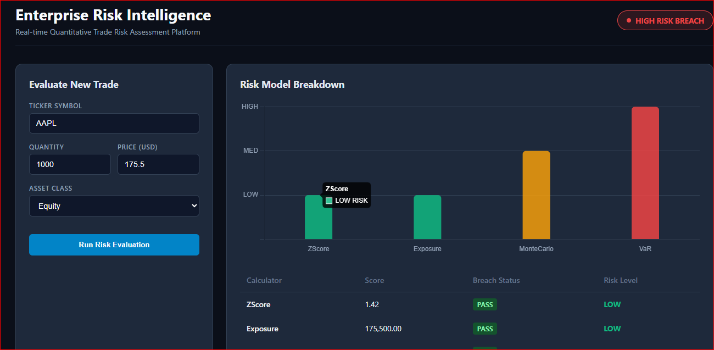
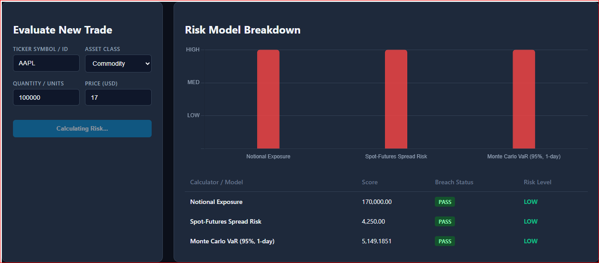
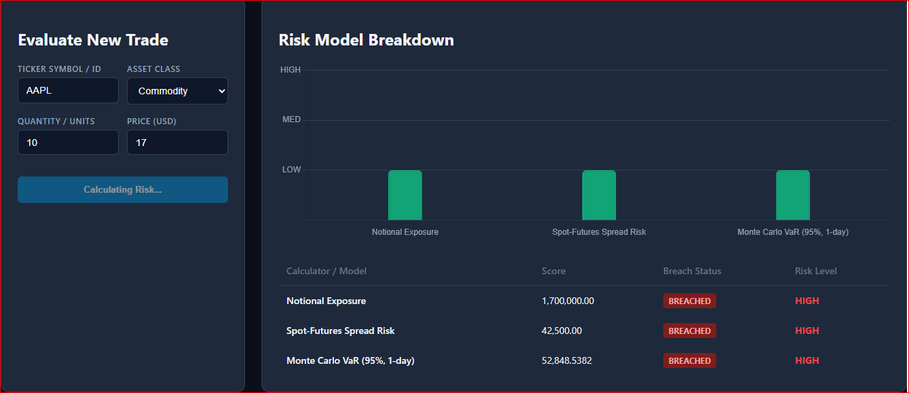
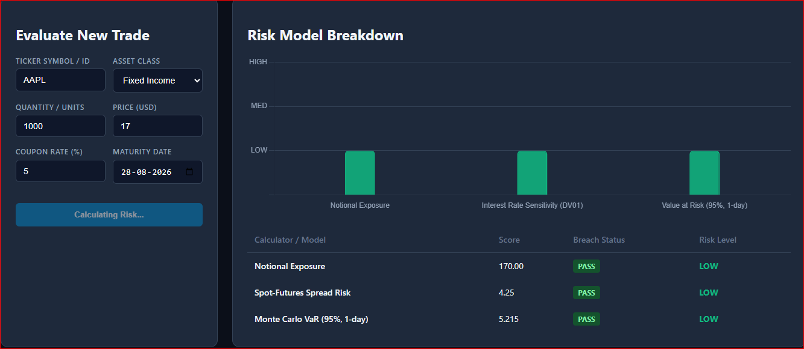
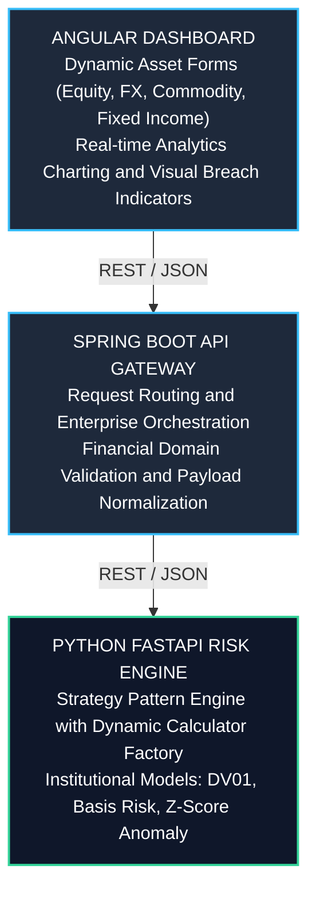
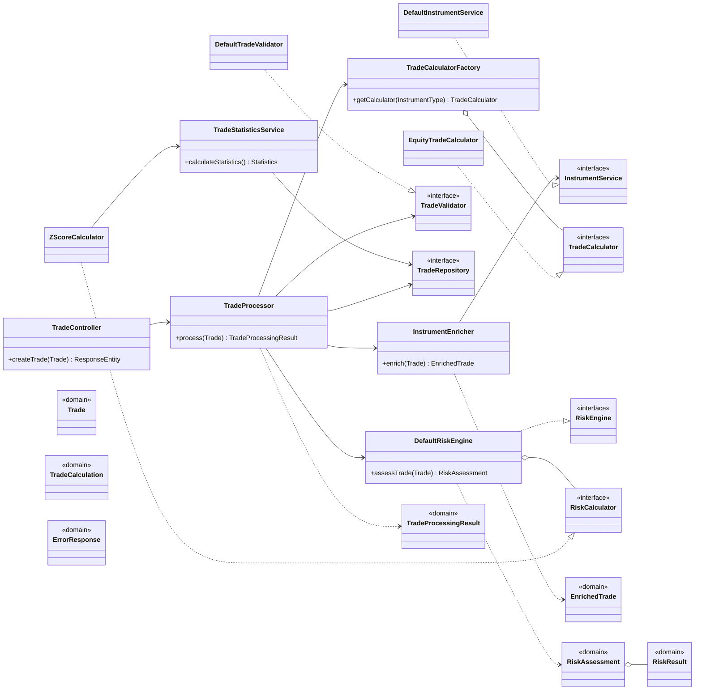

# 🚀 Enterprise Multi-Asset Risk Intelligence Platform

A real-time quantitative risk engine built around a **Python risk core** (FastAPI + NumPy/SciPy-based calculators) that models market, credit, and rate risk across asset classes using Monte Carlo simulation, parametric VaR, Z-score anomaly detection, and interest-rate sensitivity (DV01/basis risk) methods. A thin **Spring Boot gateway** handles routing and validation, and an **Angular dashboard** visualizes the resulting risk surface. The mathematics lives in the Python service; the other tiers exist to move data to and from it.

---

## 📸 Dashboard Preview





---

## 📐 Quantitative Risk Models

The Python risk core (`python-service/app/risk/calculators/`) implements the following models. Each calculator conforms to the shared `RiskCalculator` interface and returns a `RiskResult` (score, breach flag, risk level).

### Z-Score Anomaly Detection (`zscore.py`)

Flags a trade as anomalous relative to the historical distribution of trade sizes/notionals:

```
z = (x - μ) / σ
```

`x` is the trade's notional; `μ` and `σ` are the rolling mean and standard deviation drawn from `TradeStatisticsService`. A breach is raised when `|z|` exceeds a configured threshold (typically 2–3).

### Value at Risk — Parametric VaR (`var.py`)

Estimates the maximum expected loss at confidence level `1 - α` over horizon `t`:

```
VaR(α) = z(α) × σ_P × √t
```

`z(α)` is the standard normal quantile (1.65 for 95%, 2.33 for 99%) and `σ_P` is the position's return volatility.

### Monte Carlo Simulation (`monte_carlo.py`)

Simulates `N` terminal price paths under geometric Brownian motion and derives VaR/Expected Shortfall empirically from the simulated P&L distribution:

```
S(T) = S(0) × exp[(μ - 0.5σ²)t + σ√t × ε],   ε ~ Normal(0, 1)
```

The risk score is taken from the α-quantile of the simulated `S(T)` loss distribution rather than a closed-form assumption, capturing non-normal tail behavior.

### DV01 — Dollar Value of a Basis Point (`dv01.py`)

Measures a fixed-income position's sensitivity to a 1bp parallel shift in yield:

```
DV01 = -(ΔP / Δy) × 0.0001 ≈ P × D_mod × 0.0001
```

`D_mod` is modified duration and `P` is the position's present value.

### Basis Risk (`basis.py`)

Quantifies mismatch risk between an instrument and its hedge (e.g. futures vs. underlying, or two related rate curves):

```
Basis = P_hedge - P_underlying
```

Risk is flagged when the basis, or its volatility `σ_basis`, exceeds a tolerance band — since a widening basis erodes the effectiveness of the hedge.

### Exposure (`exposure.py`)

Computes gross/net notional exposure for the position, generally:

```
Exposure = |Q × P|
```

`Q` is quantity and `P` is price, aggregated where relevant across a netting set for portfolio-level exposure limits.

---

## 🏗️ System Architecture

The platform follows a decoupled, three-tier architecture ensuring high throughput, clear separation of concerns, and seamless scalability for adding new quantitative risk models.



### Request Flow


### Class Structure



---

## 💻 Local Development Setup

### 1. Clone Repository

```bash
git clone https://github.com/ramkiran25/trade-processor.git
cd trade-processor
```

### 2. Python Risk Engine

```bash
cd python-service
python -m venv venv
# On Windows: venv\Scripts\activate | On macOS/Linux: source venv/bin/activate
pip install -r requirements.txt
uvicorn app.main:app --reload --port 8000
```

### 3. Spring Boot Gateway

```bash
cd ../backend-service
./mvnw spring-boot:run
```

### 4. Angular Dashboard

```bash
cd ../angular-frontend
npm install
ng serve --open
```

---

## 🔗 API & Local Endpoints

Once the application services are running locally:

- **Swagger UI:** http://localhost:8080/swagger-ui.html
- **OpenAPI Spec:** http://localhost:8080/v3/api-docs
- **H2 Console:** http://localhost:8080/h2-console (JDBC URL configured in `application.properties`)
